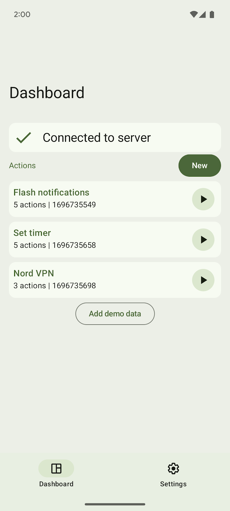
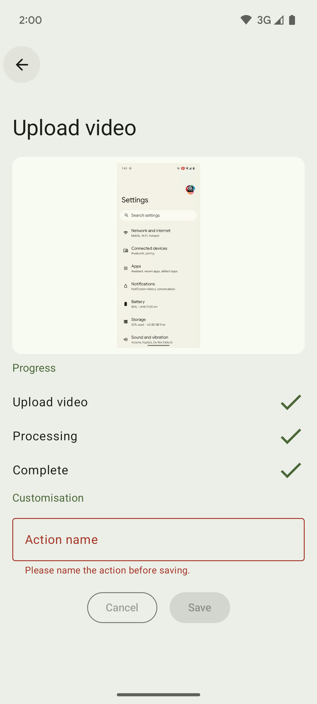
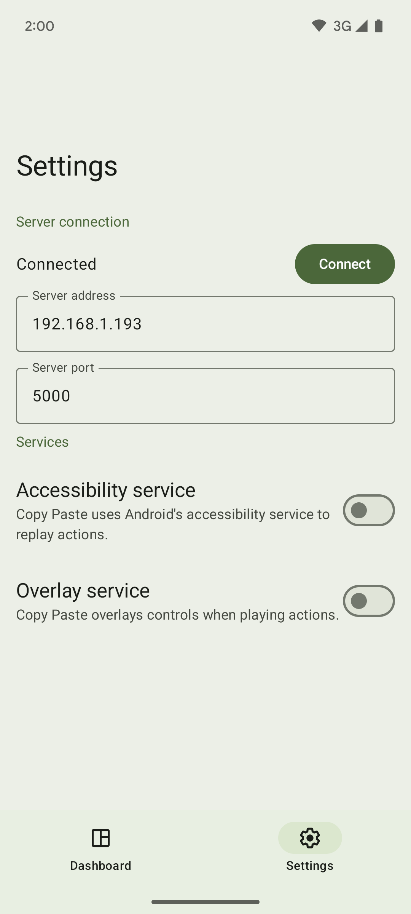

# CopyPaste

_CopyPaste_ is an Android app that can interact with _V2S_, a screen recording parser, to perform actions on behalf of a user on-device based on the parsed sequence of actions.

It uses the Android Accessibility Service to perform actions for the user, e.g. taps, long-taps and swipes, based on the parsed actions.

This app was created as part of a research project for coursework. The outputs include this app (source code), the research paper, and the presentation (linked below).

---

## Literature

| [research paper](https://link.storjshare.io/raw/jwzayv7zumsa2k76qzk4eafimz4q/dk-public/copypaste/On-device%20replay%20of%20actions%20in%20smartphone%20screen%20recordings%20-%20v1.0.pdf) | [presentation](https://link.storjshare.io/raw/jxps2nfm462emwnuqtqlaoyxn4sq/dk-public/copypaste/Presentation%20-%20v2.2.pdf) |
| ------------------------------------------------------------------------------------------------------------------------------------------------------------------------------------------ | --------------------------------------------------------------------------------------------------------------------------- |
| Formal research paper that outlines the background, method, results and discussion                                                                                                         | Succinct summary of the research project                                                                                    |

## Screenshots

|                                              |                                                 |                                            |
| -------------------------------------------- | ----------------------------------------------- | ------------------------------------------ |
|  |  |  |
